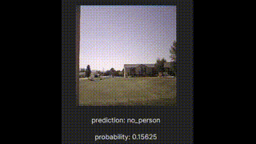

# A TensorFlow Person Detector Demo for ESP32

This is an example of using MobileNetV2 as a base model (transfer learning) in a new model that can run on the ESP32S3.

## Features

- Live MJPEG stream
- WebSocket for detection events
- Record images to SD card
- Person detection via ESP32 TensorFlow model

## Demo



## Hardware

ESP32S3 XIAO Sense

## Building the Model

### Summary

1. Import and load the pretrained MobileNetV2 model.
2. Create input layers for 1-dimensional images (ESP32 FMTRGB outputs a 1D buffer containing the image).
3. Add a new output layer for new predictions (person/no person).
4. Train on the COCO dataset.
5. Train further on a self-collected dataset.
6. Quantize the model for ESP32.

See `training/esp32_transfer_learning.ipynb` for more details.
## Training
 1. `cd .\training\`
 2. `cp .\.env.template .env`
 3. `update .env passwords `
 4. `docker compose --profile training up`
 if you add items to requirement.txt you will need to ``docker compose --profile training up --build``
 5. a server url will be output to use for jupyter
    + visit your url example: http://127.0.0.1:8888/tree?token=<token> 
    + you may also add it connect from vscode  
 6. press run all to retrain the model from scratch
### labeling
 1. `cd .\training\`
 2. ensure your .env file is created
 3. run `docker compose --profile labeling up`
 4. visit http://localhost:8080 and login with the env params
 5. add data to `esp32 person detector custom data` and label it
 6. export the project as a csv it should export a file like `training\mydata\export\project-4-at-2024-09-13-15-20-c743e35a-info.json`
 to `training\mydata\export`
 7. update csv_file_path = 'front_door_label_export.csv'
 8. follow training instructions to retrain the model with you custom data

## Compile Firmware

1. Open the root folder of this project in Platform.io.
2. `cp src\wifikeys.template src\wifikeys.h` and input your wifi information
3. `pio run`

## Upload firmware
`pio run --target upload --upload-port <COM_PORT>`
## Unit Tests

Run the following command to execute unit tests:

```sh
pio test